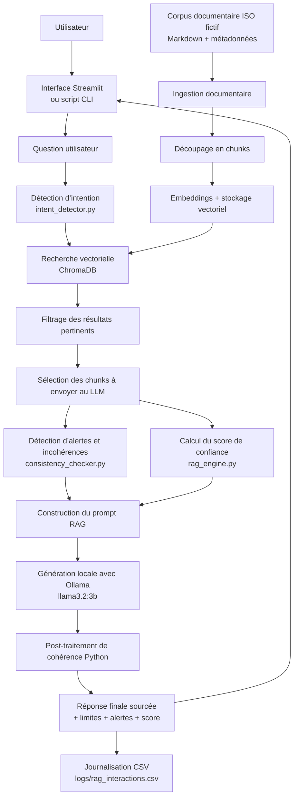
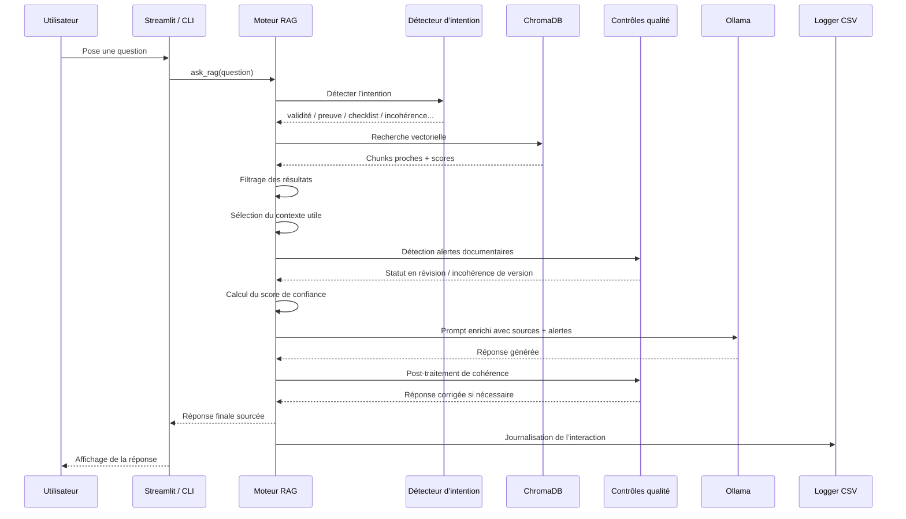
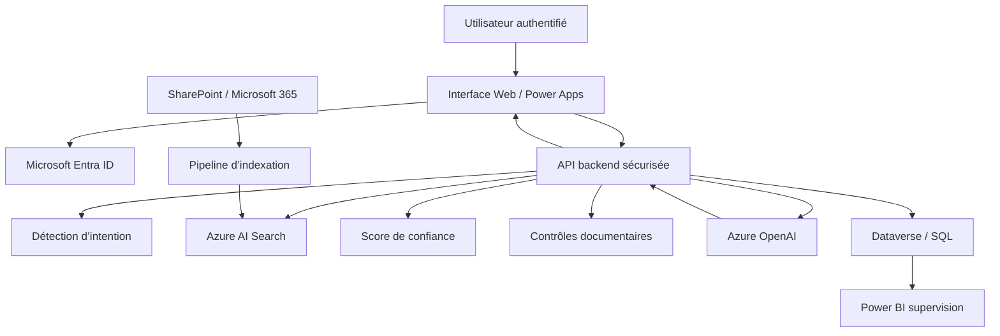

# Architecture du PoC — Assistant IA RAG ISO

## Objectif du document

Ce document présente l’architecture fonctionnelle du PoC **Assistant IA RAG ISO**.

Le système permet d’interroger une documentation qualité ISO fictive et de produire :

- une réponse sourcée ;
- les extraits documentaires utilisés ;
- un niveau de confiance explicable ;
- des alertes documentaires ;
- une détection simple d’incohérences ;
- une journalisation des interactions.

L’objectif n’est pas de remplacer un auditeur ou un responsable qualité, mais de proposer un assistant d’analyse documentaire fiable, prudent et traçable.

---

# 1. Vue d’ensemble de l’architecture



---

# 2. Lecture simplifiée du fonctionnement

Le système suit deux grands flux :

## 2.1 Flux d’ingestion documentaire

```txt
Documents Markdown
↓
Chargement des métadonnées
↓
Découpage en chunks
↓
Création d’embeddings
↓
Stockage dans ChromaDB
```

Ce flux est exécuté avec :

```bash
python scripts/ingest_documents.py
```

---

## 2.2 Flux de réponse à une question

```txt
Question utilisateur
↓
Détection d’intention
↓
Recherche vectorielle
↓
Filtrage des chunks pertinents
↓
Sélection métier du contexte
↓
Détection d’alertes et incohérences
↓
Calcul du score de confiance
↓
Génération locale Ollama
↓
Contrôle de cohérence Python
↓
Réponse finale sourcée
↓
Journalisation
```

---

# 3. Diagramme détaillé du traitement d’une question



---

# 4. Description des composants

## 4.1 Interface utilisateur

### Fichiers concernés

```txt
app/main.py
scripts/ask_rag.py
```

### Rôle

L’utilisateur peut interagir avec le système de deux façons :

- via l’interface web Streamlit ;
- via la ligne de commande.

L’interface affiche :

- la question ;
- la réponse ;
- l’intention détectée ;
- le score de confiance ;
- les alertes ;
- les sources ;
- les extraits pertinents ;
- les extraits réellement envoyés au LLM ;
- l’historique des interactions.

---

## 4.2 Corpus documentaire

### Dossier concerné

```txt
data/documents/
```

### Rôle

Le corpus contient une documentation ISO fictive :

- manuel qualité ;
- procédures ;
- fiche processus ;
- registre d’actions correctives ;
- compte rendu d’audit.

Chaque document possède des métadonnées structurées :

```yaml
titre:
reference:
version:
statut:
date_validation:
proprietaire:
processus:
type_document:
```

Ces métadonnées sont utilisées pour :

- identifier les sources ;
- construire les réponses sourcées ;
- détecter les documents en révision ;
- renforcer le score de confiance ;
- réaliser certains contrôles documentaires.

---

## 4.3 Chargement documentaire

### Fichier concerné

```txt
app/document_loader.py
```

### Rôle

Ce module :

- lit les fichiers Markdown ;
- extrait les métadonnées YAML ;
- récupère le contenu textuel ;
- renvoie une structure propre exploitable par le reste du pipeline.

---

## 4.4 Chunking

### Fichier concerné

```txt
app/chunker.py
```

### Rôle

Le texte des documents est découpé en chunks.

Le chunking permet :

- d’éviter d’envoyer tout un document au modèle ;
- de rechercher seulement les passages utiles ;
- d’améliorer la précision de la récupération.

Paramètres actuels :

```txt
Taille cible : 1200 caractères
Overlap : 200 caractères
```

---

## 4.5 Base vectorielle

### Fichier concerné

```txt
app/vector_store.py
```

### Technologie

```txt
ChromaDB
```

### Rôle

La base vectorielle stocke les chunks et permet de retrouver les passages les plus proches d’une question.

Elle intervient dans :

```txt
Question
↓
Embedding de la question
↓
Comparaison avec les embeddings des chunks
↓
Retour des chunks les plus proches
```

---

## 4.6 Détection d’intention

### Fichier concerné

```txt
app/intent_detector.py
```

### Rôle

Le système détecte l’intention générale de la question :

- validité documentaire ;
- preuve d’audit ;
- checklist d’audit ;
- procédure métier ;
- incohérence documentaire ;
- question générale.

Cette étape permet d’améliorer la sélection du contexte.

Exemple :

```txt
Question :
Quels documents prouvent qu’un audit interne a été réalisé ?

Intention :
Preuve d’audit
```

Le moteur privilégie alors :

```txt
CR-AUD-2025-001
PROC-AUD-001
```

---

## 4.7 Sélection des chunks envoyés au LLM

### Fichier concerné

```txt
app/rag_engine.py
```

### Rôle

Le système distingue :

- les extraits pertinents affichés à l’utilisateur ;
- les extraits réellement transmis au modèle Ollama.

Cela évite :

- d’envoyer trop de contexte ;
- de noyer le modèle ;
- de réduire la qualité de la réponse.

Exemple :

```txt
6 extraits pertinents affichés
3 extraits réellement envoyés au LLM
```

---

## 4.8 Détection d’alertes documentaires

### Fichiers concernés

```txt
app/rag_engine.py
app/consistency_checker.py
```

### Alertes actuellement supportées

#### Document non pleinement applicable

Exemple :

```txt
PROC-RISK-001
Statut : En révision
```

Alerte :

```txt
Le document ne doit pas être utilisé comme seule référence applicable sans validation humaine.
```

#### Incohérence de version

Exemple :

```txt
CR-AUD-2025-001 mentionne FP-ACH-001 version 1.0
FP-ACH-001 est actuellement indexé en version 1.1
```

Alerte :

```txt
Incohérence de version détectée.
```

---

## 4.9 Score de confiance

### Fichier concerné

```txt
app/rag_engine.py
```

### Rôle

Le score de confiance est un indicateur simple et explicable.

Il prend en compte :

- le meilleur score de similarité ;
- le score moyen de similarité ;
- le nombre de sources ;
- les documents non validés ;
- les alertes documentaires ;
- les incohérences détectées.

Exemple :

```txt
Faible (0.47)
```

Avec explication :

```txt
- 4 sources distinctes retrouvées
- 1 incohérence de version détectée
- la confiance est réduite en conséquence
```

---

## 4.10 Génération avec Ollama

### Fichier concerné

```txt
app/ollama_client.py
```

### Rôle

Le système transmet à Ollama :

- la question ;
- les sources sélectionnées ;
- les extraits retenus ;
- le score de confiance ;
- les alertes documentaires.

Le modèle génère ensuite une réponse structurée :

- réponse synthétique ;
- sources utilisées ;
- points de vigilance ;
- limites.

---

## 4.11 Post-traitement de cohérence

### Fichier concerné

```txt
app/rag_engine.py
```

### Rôle

Après la génération, le système vérifie certaines affirmations du LLM.

Exemple :

Si Ollama affirme :

```txt
FP-ACH-001 est en révision.
```

alors que les métadonnées indiquent :

```txt
FP-ACH-001 = Validé
```

le système ajoute une correction automatique :

```txt
Correction automatique : FP-ACH-001 a le statut indexé 'Validé'.
```

Cela illustre une approche prudente :

```txt
Le LLM propose.
Le système vérifie.
```

---

## 4.12 Journalisation

### Fichier concerné

```txt
app/logger.py
```

### Fichier de sortie

```txt
logs/rag_interactions.csv
```

### Rôle

Chaque interaction est enregistrée avec :

- date ;
- question ;
- intention ;
- mode de génération ;
- niveau de confiance ;
- explication du score ;
- sources ;
- alertes ;
- nombre d’extraits ;
- réponse.

Cette journalisation permet :

- la traçabilité ;
- l’auditabilité ;
- l’analyse des réponses faibles ;
- l’amélioration continue du système.

---

# 5. Architecture sécurité et prudence

Le PoC applique plusieurs principes :

```txt
Corpus fictif
↓
Pas d’envoi de documents réels sensibles
↓
Ollama local
↓
Réponses sourcées
↓
Score de confiance explicable
↓
Alertes documentaires
↓
Refus de répondre hors corpus
↓
Validation humaine obligatoire
```

Cette architecture illustre une approche responsable de l’IA générative dans les SI.

---

# 6. Cas de refus prudent

Lorsqu’aucune source suffisamment pertinente n’est disponible, le moteur n’appelle pas le LLM.

Exemple :

```txt
Question :
Quelle est la politique de cybersécurité de l’entreprise ?
```

Réponse :

```txt
Je ne peux pas répondre de manière fiable avec les documents disponibles.
```

Ce comportement réduit le risque d’hallucination.

---

# 7. Architecture cible future

Une version entreprise pourrait évoluer vers l’architecture suivante :



---

# 8. Évolutions possibles

Les principales améliorations futures sont :

- authentification Microsoft Entra ID ;
- contrôle d’accès documentaire ;
- ingestion de documents SharePoint ;
- Azure AI Search ;
- Azure OpenAI ;
- base SQL ou Dataverse ;
- supervision Power BI ;
- évaluation automatique des réponses ;
- moteur de reranking avancé ;
- citations par page et section ;
- prise en charge de PDF et documents Office ;
- journalisation sécurisée et gouvernée.

---

# 9. Message clé

> L’architecture du PoC montre comment un assistant RAG peut être conçu de manière modulaire, explicable et prudente pour accompagner l’exploitation d’une documentation qualité, tout en conservant des garde-fous sur la confiance, les incohérences documentaires et la validation humaine.
